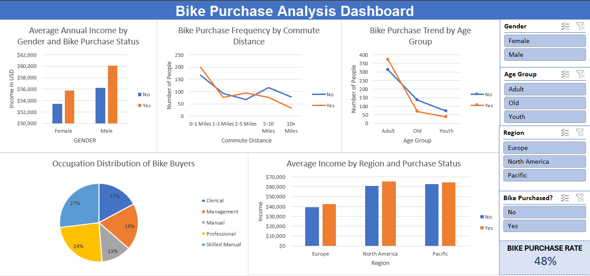

# Bike Purchase Analysis Dashboard

This project is an interactive Excel dashboard designed to analyze bike purchase trends using demographic and socioeconomic data. The dashboard provides valuable insights into how factors such as gender, age, region, occupation, income, and commute distance influence bike purchasing behavior.

---

## 📂 Files Included

| File Name                     | Description                                 |
|-------------------------------|---------------------------------------------|
| `bike_purchase_dashboard.xlsx` | The interactive Excel dashboard             |
| `bike_purchase_dataset.xlsx`   | Source data used to build the dashboard     |
| `README.md`                   | Project documentation                       |

---

## Features

- **Average Annual Income by Gender and Bike Purchase Status:**  
  Compare average incomes of males and females based on whether they purchased a bike.

- **Bike Purchase Frequency by Commute Distance:**  
  Visualize how commute distance affects the likelihood of purchasing a bike.

- **Bike Purchase Trend by Age Group:**  
  Analyze bike purchase trends across different age groups (Adult, Old, Youth).

- **Occupation Distribution of Bike Buyers:**  
  Pie chart showing the distribution of bike buyers by occupation.

- **Average Income by Region and Purchase Status:**  
  Compare average income across regions (Europe, North America, Pacific) and purchase status.

- **Interactive Filters (Slicers):**  
  - Gender  
  - Age Group  
  - Region  
  - Bike Purchased Status

- **Key Metric:**  
  - **Bike Purchase Rate:** Displays the overall percentage of people who purchased bikes (48%).

---

## How to Use

1. **Open the Excel file** containing the dashboard.
2. **Use the slicers** on the right to filter the dashboard by gender, age group, region, and purchase status.
3. **Explore the charts** to identify patterns and insights related to bike purchases.

---

## Key Insights

- **Income Impact:** Higher income groups, especially males, are more likely to purchase bikes.
- **Commute Distance:** Shorter commute distances see higher bike purchase frequencies.
- **Age Group:** Adults are the most frequent bike buyers.
- **Occupation:** Professional and skilled manual workers form the largest segments of bike buyers.
- **Regional Differences:** North America shows the highest average income among bike buyers.

---

## Screenshot

---

## License

This project is for educational and analytical purposes.  
Feel free to use or modify for your own learning or portfolio.

---
